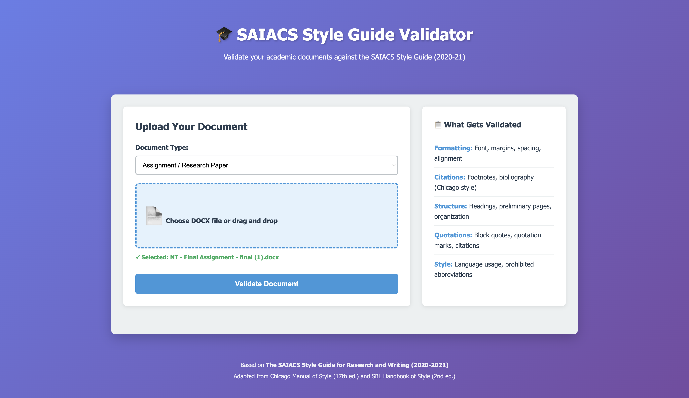
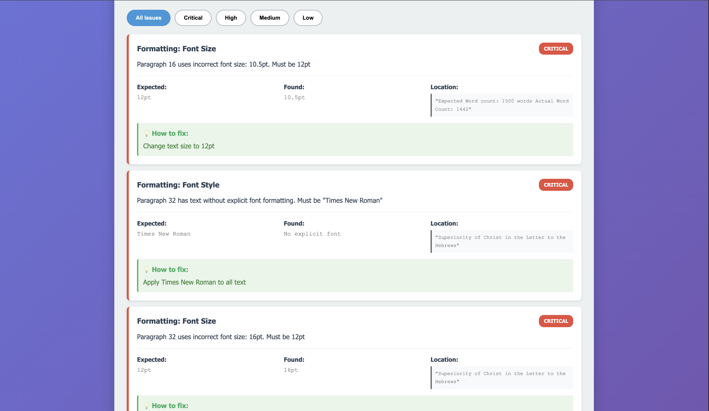

# 🎓 SAIACS Style Guide Validator

A comprehensive web-based validator for academic documents written according to **The SAIACS Style Guide for Research and Writing (2020-2021)**. This tool automatically checks DOCX files for compliance with formatting, citation, structure, and style requirements.

## 📸 Screenshots

### Main Interface

*Upload your DOCX file and select document type (Assignment or Dissertation)*

### Validation Results

*Get detailed validation results with severity levels, expected vs found values, and fix suggestions*

## 📋 Table of Contents

- [Features](#features)
- [What Gets Validated](#what-gets-validated)
- [Installation](#installation)
- [Usage](#usage)
- [Project Structure](#project-structure)
- [Troubleshooting](#troubleshooting)

## ✨ Features

- **Comprehensive Validation**: Checks 100+ rules from the SAIACS Style Guide
- **Multiple Document Types**: Supports both assignments and dissertations
- **Detailed Reports**: Shows exact locations of issues with fixes
- **Severity Levels**: Critical, High, Medium, and Low priority issues
- **User-Friendly Interface**: Modern web interface with drag-and-drop
- **Downloadable Reports**: Export validation results as text files
- **Real-time Processing**: Fast analysis of DOCX files

## 🔍 What Gets Validated

### 1. Formatting
- **Font**: Times New Roman, 12pt for main text
- **Margins**: 1 inch (all sides for assignments), 1.5 inch left margin for dissertations
- **Spacing**: 1.5 line spacing
- **Alignment**: Left alignment
- **Paragraphs**: Flush left, no indent, line space between
- **Footnotes**: 10pt, single-spaced
- **Block Quotes**: >4 lines, 11pt, indented, no quotation marks

### 2. Citations (Chicago Manual of Style 17th Edition)
- **Footnote Format**: First citation full, subsequent citations abbreviated
- **Prohibited Terms**: No ibid, et al, op. cit., loc. cit., f., ff.
- **Bibliography**: Alphabetical, hanging indent, proper formatting
- **Scripture**: No footnotes for Bible verses, proper reference format
- **URLs**: Access dates for informal sources

### 3. Document Structure
- **Preliminary Pages**: Cover page, declaration, table of contents
- **Pagination**: Roman numerals for prelims, Arabic for main content
- **Headings**: Max 4 levels (1., 1.1, 1.1.1, 1.1.1.1)
- **Bibliography**: Required for documents >1500 words

### 4. Quotations & Headings
- Proper quote formatting, punctuation placement
- Correct heading hierarchy and formatting

## 🚀 Installation

### Prerequisites
- **Node.js** (v14 or higher) - [Download](https://nodejs.org/)
- **npm** (comes with Node.js)

### Setup Steps

1. **Navigate to Project Directory**
   ```bash
   cd saiacs-style-validator
   ```

2. **Install Dependencies**
   ```bash
   npm install
   ```

3. **Verify Installation**
   ```bash
   node --version  # Should show v14+
   ```

## 📖 Usage

### Starting the Server

```bash
npm start
```

Or for development with auto-restart:
```bash
npm run dev
```

### Access the Web Interface

1. Open browser to: **http://localhost:3000**
2. Select document type (Assignment or Dissertation)
3. Upload your DOCX file (drag & drop or click to browse)
4. Click "Validate Document"
5. Review results and download report

### Using the API

```bash
curl -X POST http://localhost:3000/api/validate \
  -F "document=@/path/to/file.docx" \
  -F "documentType=assignment"
```

## 📁 Project Structure

```
saiacs-style-validator/
├── README.md                      # This file
├── package.json                   # Dependencies
├── server.js                      # Express server
├── rules_categories.md            # Detailed rules
├── public/                        # Frontend
│   ├── index.html
│   ├── styles.css
│   └── app.js
└── src/
    ├── validator.js               # Main validator
    ├── parsers/
    │   └── docxParser.js          # DOCX parsing
    └── validators/
        ├── formattingValidator.js
        ├── citationValidator.js
        ├── quotationValidator.js
        ├── headingValidator.js
        └── structureValidator.js
```

## 🐛 Troubleshooting

### "Cannot find module"
```bash
npm install
```

### Port 3000 in use
Edit `server.js` line 5:
```javascript
const PORT = 3001;  // Change port
```

### DOCX parsing errors
- Ensure file is .docx (not .doc)
- Re-save file in Microsoft Word
- Check file isn't password-protected

## 🙏 Acknowledgments

Based on:
- **The SAIACS Style Guide for Research and Writing (2020-2021)**
- **Chicago Manual of Style, 17th Edition**
- **SBL Handbook of Style, 2nd Edition**

Built for **South Asia Institute of Advanced Christian Studies (SAIACS)**

---

**Version**: 1.0.0  
**Last Updated**: January 2025

Made with ❤️ for academic excellence
